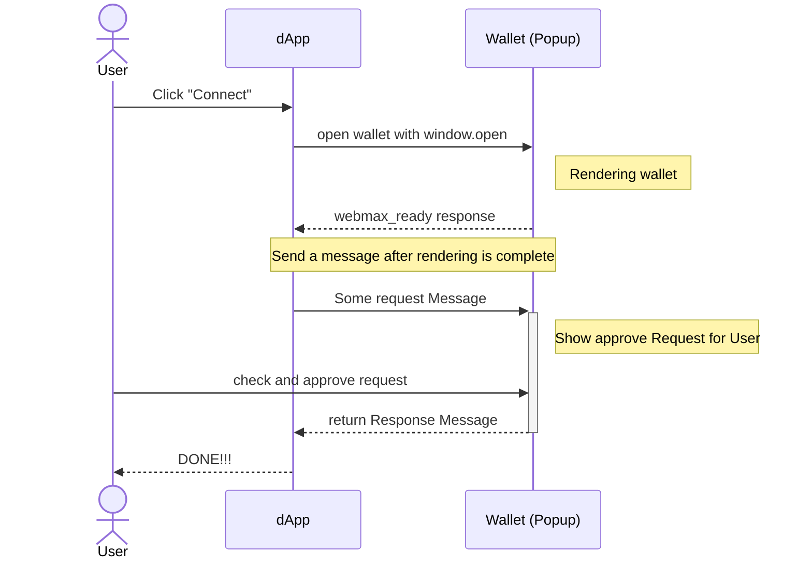

# API リファレンス

## プロトコルフローのまとめ

以下は、dApp が Web ウォレットに対して `eth_requestAccounts` などのメソッドを呼び出す際のフローです。



1. ユーザーが dApp の「Connect」ボタンをクリックします。
2. dApp が `window.open` でウォレットを開きます。
3. ウォレットが開かれ、初期化されます。
4. 初期化完了後、ウォレットが `webmax_ready` メッセージを送信します。
5. 初期化を確認した後、dApp が `eth_requestAccounts` などのメッセージを送信します。
6. ウォレットがリクエスト内容をユーザーに表示します。
7. ユーザーがリクエスト内容を確認し、承認します。
8. ウォレットがレスポンスを送信します。
9. dApp がレスポンスを受信し、必要に応じてウィンドウを閉じます。

## メッセージ形式

### 拡張 JSON-RPC

Ethereum をはじめとする多くのブロックチェーン向けウォレットは、JSON-RPC メソッドとして操作を提供しています。これに基づき、JSON-RPC を継承するメッセージ形式を以下のように定義します。

```tsx
export type AbstractRequest<NS extends string = string, Params = unknown> = {
  id: number;
  namespace: NS | ChainedNamespace<NS>;
  method: string;
  params: Params;
  metadata?: unknown;
};

export type AbstractSuccessResponse<NS extends string = string, Result = unknown> = {
  id: number;
  namespace: NS | ChainedNamespace<NS>;
  method: string;
  windowHandling: WindowHandling;
  result: Result;
};

export type AbstractErrorResponse<NS extends string = string> = {
  id: number;
  namespace: NS | ChainedNamespace<NS>;
  method: string;
  windowHandling: WindowHandling;
  error: { code: number; message: string };
};

export type AbstractResponse<NS extends string = string, Result = unknown> =
  | AbstractSuccessResponse<NS, Result>
  | AbstractErrorResponse<NS>;
```

### Namespace

各メソッドには Namespace が必要であり、メソッドのグループを定義します。Namespace は各リクエストに含める必要があり、ChainID 情報を含めることもできます。

```tsx
type ChainId = string | number;
type Namespace = "eip155" | "webmax";
type ChainedNamespace = `${Namespace}:${ChainId}`;
```

**Window Handling**：レスポンス送信後のウォレットウィンドウの処理方法を指定します。例えば、ウォレットがエラーメッセージを表示したい場合に有用です。

```tsx
type WindowHandling = "keep" | "close";
```
