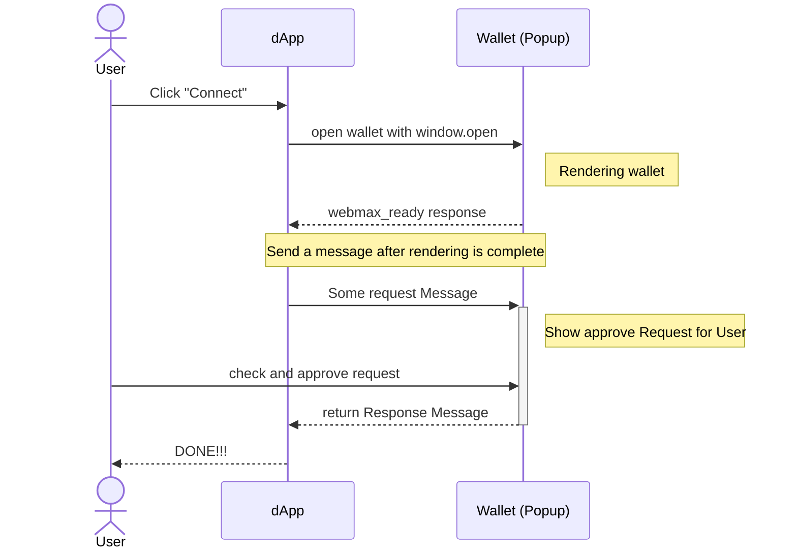

# Wallet SDK リファレンス

### はじめに

INTMAX WalletSDK Protocol のドキュメントです。本ガイドでは、プロトコルのコアコンセプト、ウォレットや dApp 向け SDK のクイックスタート、包括的な API リファレンスを提供します。

### INTMAX WalletSDK とは

INTMAX WalletSDK は、Web ウォレットと分散型アプリケーション（dApp）のシームレスな統合を実現するために設計されたプロトコルおよび SDK です。EIP-1193 ライクなインタラクションを活用し、Web ベースのウォレットと dApp の直接通信・接続を可能にすることで、ブロックチェーンエコシステム全体のユーザー体験を向上させます。

### INTMAX WalletSDK Protocol の概要

INTMAX WalletSDK Protocol は、dApp が標準化されたインターフェースを通じて Web ウォレットとやり取りできるようにする、シンプルかつ強力なソリューションです。Web ウォレットと dApp 間の EIP-1193 準拠のインタラクションを実現するための通信メソッドとデータ構造を定義しています。本プロトコルは Web ページとして提供される Web ウォレットと dApp の連携を前提に設計されており、幅広いアプリケーションと拡張に対応します。

### コア機能

- **EIP-1193 互換性** — 本プロトコルは EIP-1193 との互換性を備えており、dApp が標準化されたインターフェースを通じて Web ウォレットを操作できます。この互換性は、多様なブロックチェーンネットワークと対話可能な dApp を構築する上で不可欠です。
- **クロスオリジン通信** — `postMessage` と `MessageEvent` を活用し、子ウィンドウ（dApp が開いた Web ウォレットのウィンドウ）と dApp 間のセキュアなクロスオリジン通信を実現します。
- **柔軟性と拡張性** — EVM ベース以外のチェーンでも使用できるよう柔軟に設計されており、Web ウォレットを dApp に統合したい開発者にとって汎用性の高いソリューションです。
- **ユーザー体験の向上** — Web ウォレットと dApp の直接通信を可能にすることで、ウォレット接続のプロセスが効率化され、ユーザー体験が向上します。

### プロトコルフロー

以下は、dApp が Web ウォレットに対して `eth_requestAccounts` などのメソッドを呼び出す際のフローです。

1. ユーザーが dApp の「Connect」ボタンをクリックします。
2. dApp が `window.open` でウォレットを開きます。
3. ウォレットが開かれ、初期化されます。
4. 初期化完了後、ウォレットが `webmax_ready` メッセージを送信します。
5. 初期化を確認した後、dApp が `eth_requestAccounts` などのメッセージを送信します。
6. ウォレットがリクエスト内容をユーザーに表示します。
7. ユーザーがリクエスト内容を確認し、承認します。
8. ウォレットがレスポンスを送信します。
9. dApp がレスポンスを受信し、必要に応じてウィンドウを閉じます。
